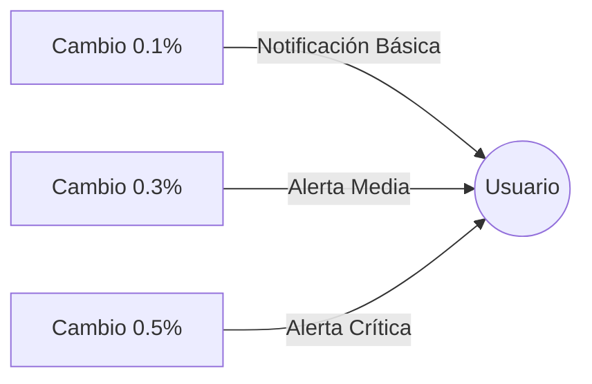

# LIMBO 🏦📈  
*Aplicación Android para seguimiento de criptomonedas y regulaciones bancarias en Bolivia*

---

## 📌 Tabla de Contenidos  
1. [Introducción](#-introducción)  
2. [Características Principales](#-características-principales)  
3. [Arquitectura](#-arquitectura)  
4. [Tecnologías y Dependencias](#-tecnologías-y-dependencias)  
5. [Flujo de Datos](#-flujo-de-datos)  
6. [Estructura del Proyecto](#-estructura-del-proyecto)  
7. [Configuración y Uso](#-configuración-y-uso)  
8. [Roadmap y Contribuciones](#-roadmap-y-contribuciones)  

---

## 🌍 Introducción  
**LIMBO** resuelve dos problemas críticos para usuarios bolivianos:  
1. **Volatilidad del USDT/BOB** en plataformas P2P (Binance, Bitget, Eldorado)  
2. **Falta de claridad** en límites de tarjetas bancarias para compras internacionales  

Combina en tiempo real:  
✅ Tasas de cambio cripto actualizadas cada 15 minutos  
✅ Base de datos de políticas de 12+ bancos bolivianos  
✅ Sistema inteligente de alertas por cambios ≥0.1%  

---

## 🚀 Características Principales  

### 📊 Monitoreo Cripto  
| Exchange       | Características                              |  
|----------------|---------------------------------------------|  
| **Binance P2P** | Gráficos históricos + spreads de compra/venta |  
| **Bitget**      | Comparación multi-exchange en tiempo real    |  
| **Eldorado**    | Alertas personalizadas por margen de ganancia|  

### 🏦 Información Bancaria  
- Límites detallados para Visa/MasterCard/Amex  
- Compatibilidad con plataformas internacionales (Steam, AWS, Netflix)  
- Restricciones ATM y compras online  
- Actualizaciones mensuales de políticas BCB  

### 🔔 Sistema de Notificaciones  

🏗️ Arquitectura
MVVM Optimizado

class CryptoMarketViewModel : ViewModel() {
    private val _marketData = MutableLiveData<CryptoMarketData>()
    val marketData: LiveData<CryptoMarketData> = _marketData
    
    fun loadData() {
        viewModelScope.launch {
            _marketData.value = CriptoYaApiService.getPrices()
        }
    }
}

Componentes clave:

* RetrofitClient: Conexión a API CriptoYa (200 req/hora)

* WorkManager: Monitoreo en segundo plano con políticas de reintento

* MPAndroidChart: Renderizado eficiente de 10,000+ puntos de datos

💻 Tecnologías y Dependencias

Stack Principal

Categoría	Tecnologías
--------------------------------------------------------
Lenguaje	Kotlin 1.9 + Corrutinas
--------------------------------------------------------
Persistencia	Room DB + DataStore
--------------------------------------------------------
Networking	Retrofit 2.9 + OkHttp3
--------------------------------------------------------
UI	Material Design 3 + MPAndroidChart
--------------------------------------------------------

Dependencias Clave

dependencies {
    // Monitoreo en segundo plano
    implementation("androidx.work:work-runtime-ktx:2.8.1") 
    
    // Gráficos avanzados
    implementation("com.github.PhilJay:MPAndroidChart:v3.1.0")  
    
    // API Cripto
    implementation("com.squareup.retrofit2:converter-gson:2.9.0")  
}

🔄 Flujo de Datos

1. Capa de Datos

	* Retrofit → API CriptoYa (JSON)

	* Room → Almacenamiento local de políticas bancarias

2. Lógica de Negocio

	* ViewModels procesan datos para UI

	* WorkManager ejecuta CryptoChangeMonitorService cada 15 min

3. Presentación

	* Gráficos interactivos con zoom/pinch

	* Adaptadores personalizados para listas bancarias

📂 Estructura del Proyecto

app/
└── src/main/
    ├── java/com/example/limbo/
    │   ├── Model/                  # Lógica de datos
    │   │   ├── Apis/               # Conexiones API
    │   │   └── Services/           # Monitoreo background
    │   ├── ViewModel/              # Lógica de presentación
    │   └── Views/                  # Activities/Fragments
    └── res/
        ├── layout/                 # XMLs de UI
        └── values/                 # Strings/Colores

⚙️ Configuración y Uso

Requisitos Técnicos

	* SDK Mínimo: API 26 (Android 8.0)

	* Permisos:

		<uses-permission android:name="android.permission.INTERNET" />
		<uses-permission android:name="android.permission.POST_NOTIFICATIONS" />

Personalización

En SettingsActivity:

	1. Seleccionar exchanges a monitorear

	2. Ajustar umbrales de notificación (0.1% - 5.0%)

	3. Configurar intervalo de actualización (15-60 min)

🛣️ Roadmap y Contribuciones

Próximas Funcionalidades

	* Integración con APIs de bancos locales

	* Modo oscuro/lectura nocturna

	* Historial de precios exportable (CSV/PDF)

Cómo Contribuir

	1. Clona el repositorio

	2. Abre una rama para tu feature (git checkout -b feature/awesome)

	3. Sigue las guías de estilo Kotlin del proyecto

	4. Envía un PR con tests asociados

📌 Nota para Desarrolladores

El servicio CryptoChangeMonitorService utiliza políticas de backoff para evitar bloqueos por APIs rate-limited. Se recomienda usar el emulador con Android 14+ para testing completo.

// Ejemplo de política de reintento
val workRequest = OneTimeWorkRequestBuilder<CryptoChangeMonitorService>()
    .setBackoffCriteria(
        BackoffPolicy.EXPONENTIAL,
        10L,
        TimeUnit.SECONDS
    )
    .build()

		Desarrollado con ❤️ para la comunidad boliviana - Licencia MIT 

				LIM.BO 2025 - JYA
